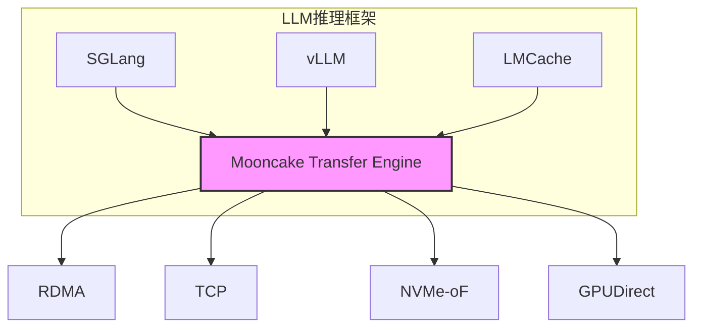
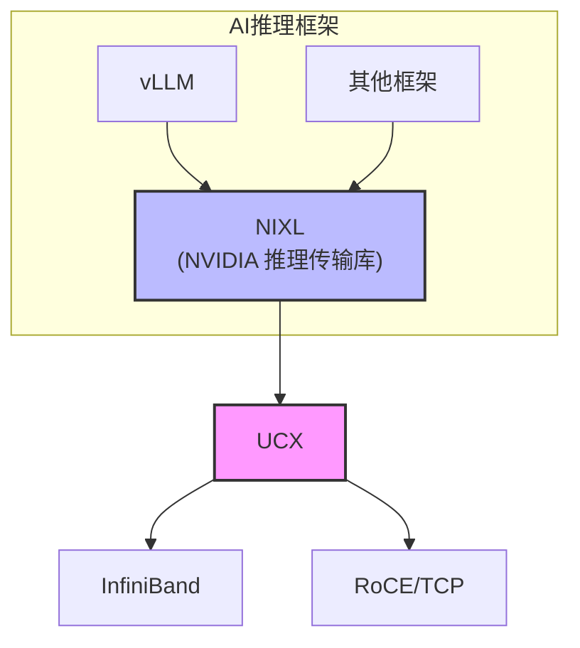
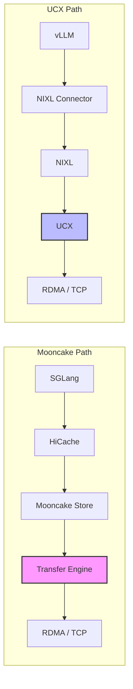

# Mooncake Transfer Engine vs UCX 对比分析

本文档对比分析 Mooncake Transfer Engine 和 UCX（Unified Communication X）在 LLM 推理框架中的定位、生态、使用便利性和优劣势。

## 1. 概述

### Mooncake Transfer Engine

Mooncake Transfer Engine 是 Moonshot AI 为 LLM 推理场景专门设计的高性能零拷贝数据传输库。核心抽象：
- **Segment**：可远程读写的连续地址空间（DRAM/VRAM/NVMe）
- **BatchTransfer**：异步批量数据传输操作

### UCX (Unified Communication X)

UCX 是由 NVIDIA、Mellanox 等推动的通用高性能通信框架，广泛用于 HPC 领域。核心特点：
- 抽象通信原语，支持多种硬件后端
- 集成到 OpenMPI、OpenSHMEM 等主流并行编程框架
- 通过 NIXL（NVIDIA Inference Xfer Library）进入 LLM 推理领域

## 2. 定位对比

| 维度 | Mooncake Transfer Engine | UCX |
|------|-------------------------|-----|
| **设计目标** | LLM 推理场景优化 | 通用 HPC/AI 通信 |
| **核心用户** | LLM 推理框架（SGLang、vLLM） | HPC 应用、MPI 用户 |
| **抽象层次** | 高层（Segment/BatchTransfer） | 中层（端点/内存句柄） |
| **专注领域** | KVCache 传输、PD 分离 | 通用点对点/集合通信 |

## 3. 生态对比

### Mooncake 生态

- **SGLang**：原生集成，HiCache L3 后端
- **vLLM**：通过 MooncakeStoreConnector 集成
- **LMCache**：作为分布式缓存后端
- **LMDeploy**：集成支持

### UCX 生态

- **HPC 领域**：OpenMPI、OpenSHMEM 深度集成
- **AI 推理**：通过 NIXL 被 vLLM 支持
- **NVIDIA 生态**：HPC-X 工具包标配组件

## 4. 使用便利性对比

### 4.1 集成复杂度

| 方面 | Mooncake Transfer Engine | UCX |
|------|-------------------------|-----|
| **API 复杂度** | 简单（Segment + BatchTransfer） | 复杂（多层抽象） |
| **依赖管理** | 轻量，可独立编译 | 依赖较多（ibverbs 等） |
| **配置项** | 环境变量为主，开箱即用 | 丰富的运行时配置 |
| **学习曲线** | 低（面向场景优化） | 高（通用框架） |

### 4.2 部署便捷性

| 方面 | Mooncake Transfer Engine | UCX |
|------|-------------------------|-----|
| **单机部署** | 支持 TCP 回退 | 支持共享内存 |
| **RDMA 集群** | 自动发现设备 | 需配置 UCX_TLS |
| **云环境** | 支持 AWS EFA | 需额外配置 |
| **异构硬件** | 支持昇腾、鲲鹏 | 主要 NVIDIA/Intel |

### 4.3 语言绑定

| 语言 | Mooncake Transfer Engine | UCX |
|------|-------------------------|-----|
| C/C++ | ✅ 原生 | ✅ 原生 |
| Python | ✅ 官方绑定 | ✅ ucx-py |
| Rust | ✅ 官方绑定 | ⚠️ 社区维护 |
| Golang | ✅ 官方绑定 | ⚠️ 社区维护 |

## 5. 优劣势分析

### Mooncake Transfer Engine

**优势：**

1. **场景优化**：专为 LLM 推理设计，KVCache 传输效率高
2. **零拷贝**：真正的零拷贝传输，减少 CPU 开销
3. **GPUDirect**：原生支持 GPU Direct RDMA，VRAM 直传
4. **轻量级**：依赖少，集成简单
5. **Rust 支持**：官方 Rust 绑定，适合现代推理框架
6. **统一抽象**：Segment 抽象统一 DRAM/VRAM/NVMe
7. **生产验证**：Kimi 生产环境大规模使用

**劣势：**

1. **生态较小**：相比 UCX 生态圈小
2. **通用性弱**：专注于推理场景，不适合通用 HPC
3. **社区规模**：开源社区相对较小
4. **文档完善度**：相比 UCX 文档较少

### UCX

**优势：**

1. **成熟稳定**：多年 HPC 领域验证
2. **生态丰富**：广泛的社区和工具支持
3. **硬件支持**：覆盖主流网络硬件
4. **NVIDIA 支持**：官方维护，持续更新
5. **通用性强**：适用各种通信模式
6. **NIXL 集成**：NVIDIA 推理传输标准

**劣势：**

1. **复杂度高**：API 复杂，学习曲线陡峭
2. **依赖多**：编译和部署依赖较多
3. **Rust 支持弱**：社区维护，不够稳定
4. **场景通用**：未针对 LLM 推理优化
5. **配置复杂**：运行时配置项繁多

## 6. 性能对比

根据 Mooncake 官方基准测试：

| 指标 | Mooncake Transfer Engine | UCX（通过 NIXL） |
|------|-------------------------|------------------|
| **小消息延迟** | 更低（针对优化） | 较高 |
| **大块吞吐** | 接近线速 | 接近线速 |
| **CPU 开销** | 更低（零拷贝） | 较高 |
| **GPU 直传** | 原生支持 | 需配置 |
| **多路径** | 支持 | 支持 |

## 7. 选型建议

### 选择 Mooncake Transfer Engine 的场景

- LLM 推理框架开发
- 需要 GPU Direct RDMA
- 追求最小依赖和最简集成
- 使用 Rust/Golang 开发
- 需要统一的内存抽象（DRAM/VRAM/NVMe）
- 使用 SGLang 或需要 HiCache 特性

### 选择 UCX 的场景

- HPC + AI 混合场景
- 已有 MPI 基础设施
- 需要广泛的硬件兼容性
- 使用 vLLM + NIXL 方案
- 需要成熟的社区支持

## 8. 融合趋势

两个项目正在相互借鉴：

- **Mooncake**：扩展传输协议支持（EFA、昇腾、Sunrise Link）
- **UCX/NIXL**：增加 AI 推理场景优化
- **标准化**：可能出现统一的传输层标准

## 9. AI 推理场景下 Mooncake 的核心竞争力

### 9.1 KVCache 传输优化

Mooncake Transfer Engine 针对 LLM 推理的 KVCache 传输进行了深度优化：

- **BatchTransfer 语义**：单次操作完成多个非连续内存块的聚合传输，匹配 KVCache 分层存储特性
- **零拷贝路径**：避免 CPU 参与数据搬运，KVCache 从 GPU 显存到远端内存全程零拷贝
- **异步流水线**：传输与计算重叠，隐藏 KVCache 传输延迟

UCX 的通用点对点通信模型需要应用层自行实现批量调度和聚合逻辑。

### 9.2 GPU Direct RDMA 原生支持

| 能力 | Mooncake | UCX |
|------|----------|-----|
| VRAM 直传 | 默认启用，无需额外配置 | 需配置 GPUDirect + nvidia-peermem |
| 内存注册 | 自动 DMA-BUF 路径 | 手动 ibv_reg_mr 或 peermem |
| 多 GPU 拓扑感知 | 内置设备亲和性调度 | 需应用层实现 |

Mooncake 的 Segment 抽象统一了 DRAM/VRAM/NVMe，应用无需关心底层内存类型差异。

### 9.3 PD 分离架构原生支持

Prefill-Decode 分离是 LLM 推理扩展的关键架构：

- **Mooncake**：Transfer Engine + Store 协同，Prefill 节点写入 KVCache，Decode 节点按需拉取，内置元数据管理和缓存策略
- **UCX**：仅提供传输层，PD 分离的调度、缓存、一致性需应用层实现

### 9.4 轻量级集成与低依赖

| 方面 | Mooncake | UCX + NIXL |
|------|----------|------------|
| 编译依赖 | ibverbs（可选） | ibverbs + CUDA + 多个子库 |
| 二进制大小 | ~数 MB | ~数十 MB |
| 启动时间 | 快（轻量初始化） | 较慢（设备枚举、TLS 探测） |
| 单机回退 | TCP 自动回退 | 需配置共享内存 |

### 9.5 统一元数据服务

Mooncake 提供 HTTP/Redis 元数据服务器，用于：

- 端点发现与连接建立
- Segment 注册与寻址
- 集群拓扑感知

UCX 不提供元数据服务，需要应用层或外部服务（如 etcd、consul）自行实现。

### 9.6 推理框架深度集成

Mooncake 路径更短，减少了抽象层和潜在性能损耗。SGLang 的 HiCache 三级缓存（GPU L1 → Host L2 → Distributed L3）与 Mooncake Transfer Engine 深度耦合。

### 9.7 核心竞争力总结

| 竞争力维度 | Mooncake 优势 |
|-----------|--------------|
| **KVCache 传输** | 专用 BatchTransfer 语义，零拷贝流水线 |
| **GPU 直传** | 默认启用，Segment 统一抽象 |
| **PD 分离** | 原生架构支持，内置调度与缓存 |
| **轻量集成** | 低依赖，快速启动，TCP 自动回退 |
| **元数据服务** | 内置 HTTP/Redis，无需外部组件 |
| **推理框架** | SGLang HiCache 原生集成，路径更短 |

**结论**：在纯 LLM 推理场景下，Mooncake Transfer Engine 提供了更垂直、更高效的传输方案。UCX 的优势在于通用性和 HPC 生态兼容，但对于专注于推理服务的团队，Mooncake 是更优选择。

## 10. 参考资料

- [Mooncake Transfer Engine 文档](https://kvcache-ai.github.io/Mooncake/design/transfer-engine/index.html)
- [Mooncake GitHub](https://github.com/kvcache-ai/Mooncake)
- [UCX 官方文档](https://openucx.readthedocs.io/)
- [UCX GitHub](https://github.com/openucx/ucx)
- [NIXL GitHub](https://github.com/ai-dynamo/nixl)
- [Mooncake 论文](https://arxiv.org/abs/2407.00079)